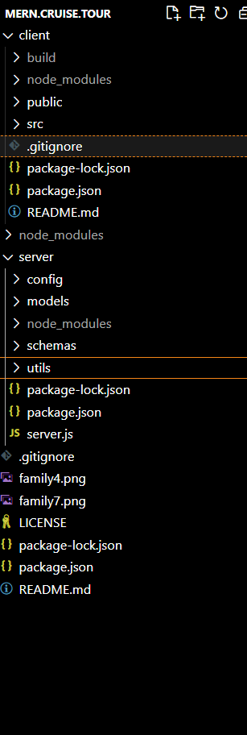
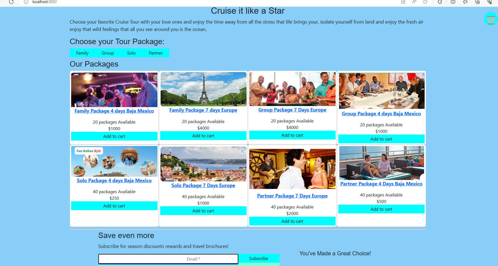
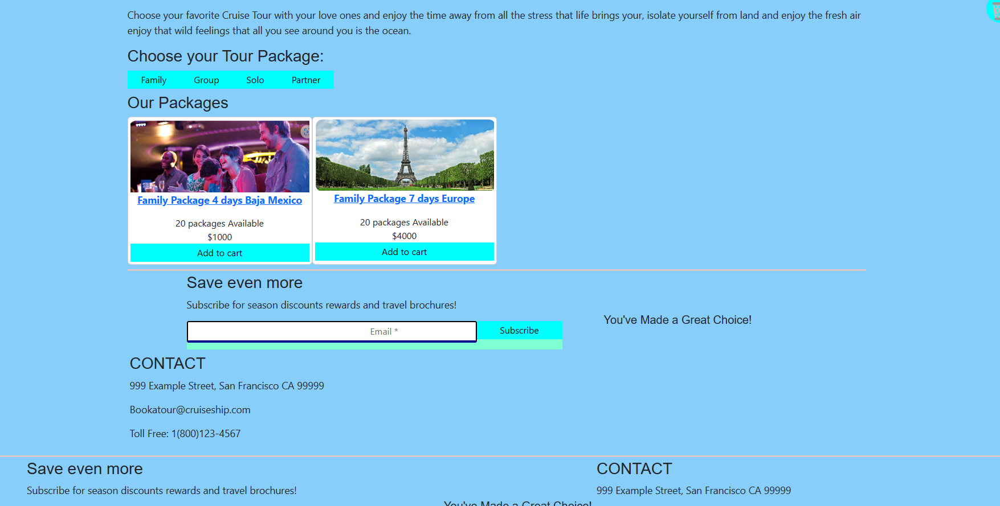
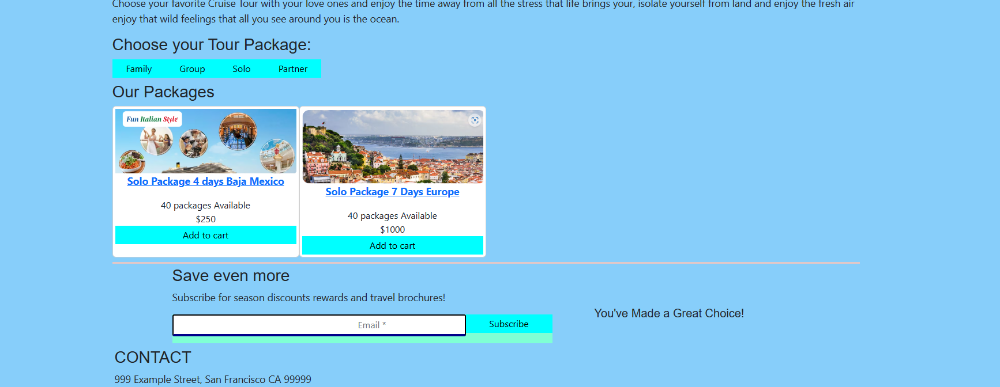
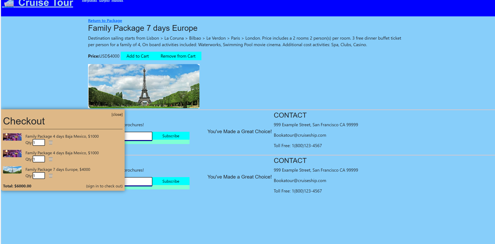
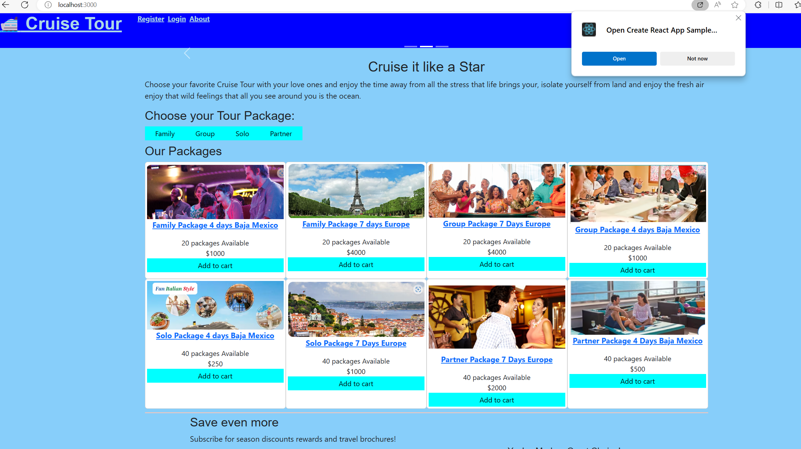
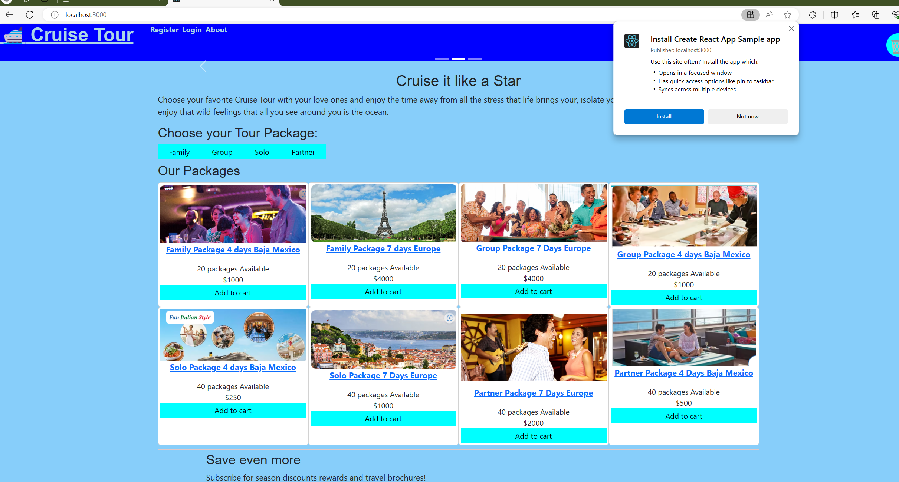
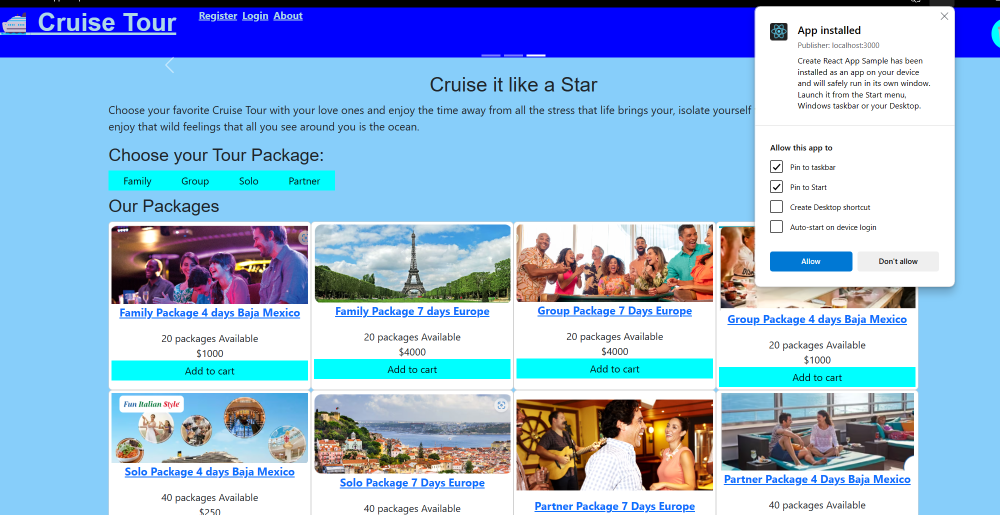
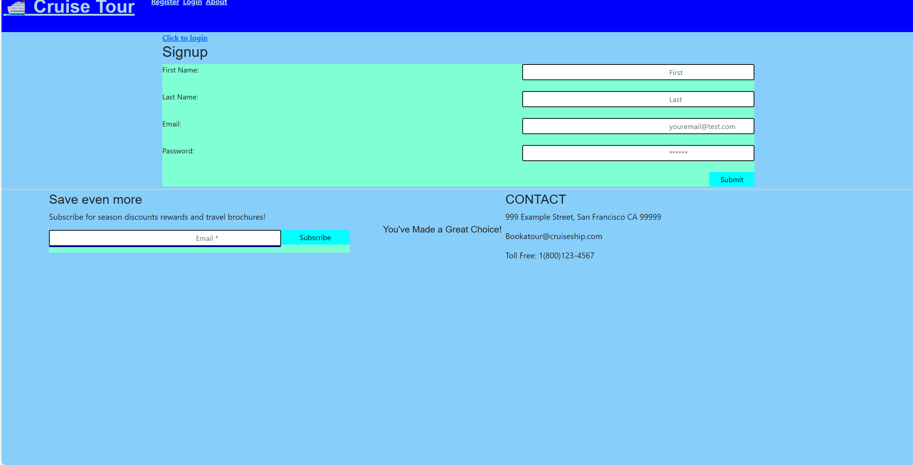
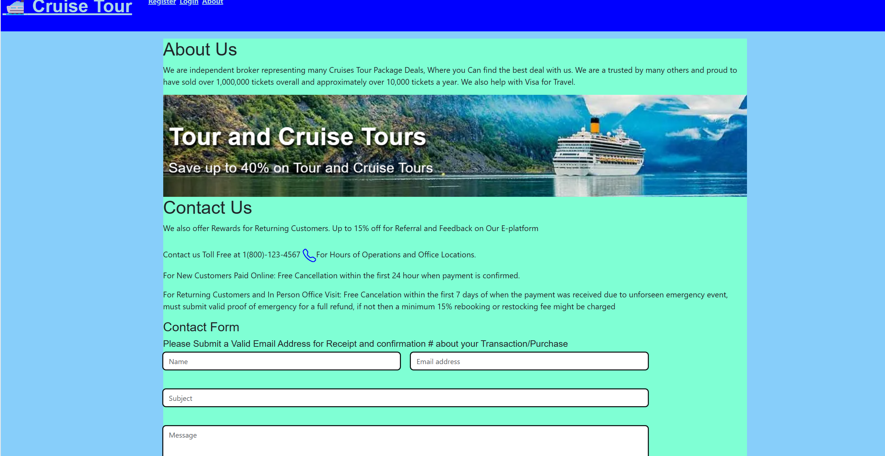

# MERN.Cruise.Tour
Project 3: MERN Stack Single-Page Application

## Description
This project is to build an application for people who loves the ocean. Travel the sea and go on cruise tours from 4 Days Tour Baja Mexico to 7 Days Euro Trip Tour. With Cruise Tour, you can travel with a group of friends, family members, soulmate, partner, your bestie, or just simply go on your own with other tourists where you will spend a 4 Days - 7 Days exploring some of the best views from Baja Mexico Tours to Europe Tours, dining at buffet on the 5 star cruise ship, and unforgettable trip on the ocean, isolate yourself from daily lives on land.  Travel tickets, buffet tickets, rooms are included in the package price.  All prices are not included with tax, applicable fees and any additional service fee.

#### Instructions
As a start and at the command prompt, type in npm install to ensure all that the dependencies are installed.

In addition, the following npm packages were installed to this application:-

Server (back end)

apollo-server-express (npm i apollo-server-express)

bcrypt (npm installl bcrypt)

dotenv (npm install dotenv)

express (npm install express)

graphql (npm install graphql)

jsonwebtoken (npm install jsonwebtoken)

mongoose (npm install mongoose)

stripe (npm install stripe --save)

Client (Front end)

reactstrap (npm install reactstrap react react-dom)

bootstrap (npm install --save bootstrap) 

react Icons (npm install react-icons --save)

react (npm i react)

react toastify (npm install --save react-toastify)

jwt-decode (npm install jwt-decode)

validator (npm i validator)

@emailjs/browser (npm install @emailjs/browser)

web vitals (npm install web-vitals)

react-hook-form (npm install react-hook-form)

react-router-dom (npm i react-router-dom)

react-scripts (npm i react-scripts)

moment (npm i moments)

graphql-tag(npm i graphql-tag)

graphql (npm install graphql)

emailjs (npm install emailjs)

date-fns (date-fns)

stripe (npm install stripe --save)

apollo-link-context (npm i apollo-link-context)

apollo Client (npm i @apollo/client)

react apollo-hooks (npm install @apollo/react-hooks)

apollo-boost (npm i apollo-boost)

MVC Module below

and more ss

Login to checkout

Installing App option to local storage

Sign up for account

Contact and About Section 

#### Build By
Chris Huynh

##### Credits
-Loader gif icon.
https://lordicon.com/

-Carnival Cruise for images and some trips options used as examples for this Project.
https://www.carnival.com/?gad_source=1&gclid=CjwKCAjwnv-vBhBdEiwABCYQA73iNwbvjb6Cd8UVrUT6hCSl3_S8un3MFqRlaMvjasVfEdn8Wv56qxoCBhMQAvD_BwE&gclsrc=aw.ds 
    

React Icons

Reactstrap Library and Documentation

React Bootstrap Documenation

EmailJS Documentation

Stripe Documentation

JWT Documentation

How to use react-icons to install Font Awesome in a React app
 

How to integrate Stripe with a React Application

Apollo Documentation

##### Links
<a href="https://github.com/ceewizz/MERN.Cruise.Tour/blob/main/README.md"> Github Repo </a>

More

<a href="https://mern-cruise-tour-01efbbed0b66.herokuapp.com/>">Heroku</a>

 And 

<a href="https://mern-cruise-tour.onrender.com">Deployed Render</a>
